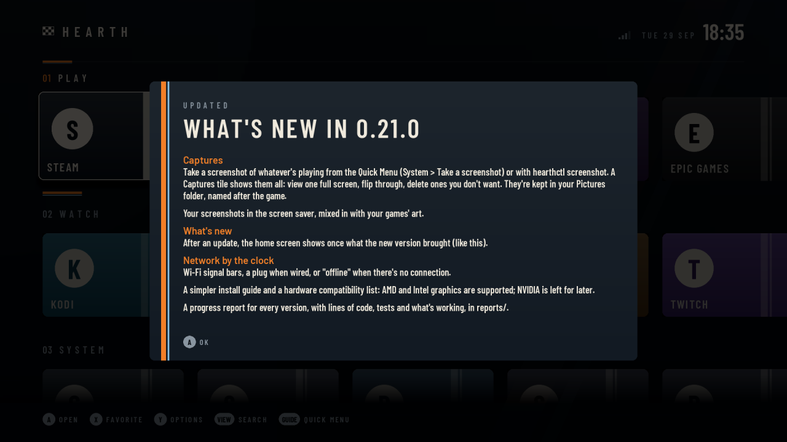
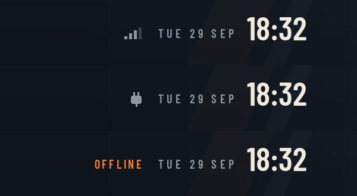
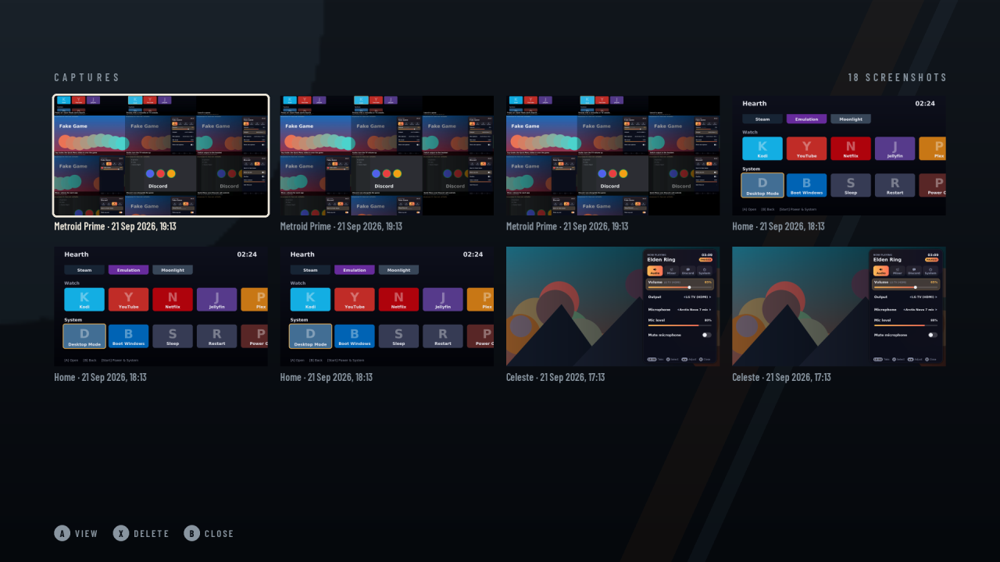
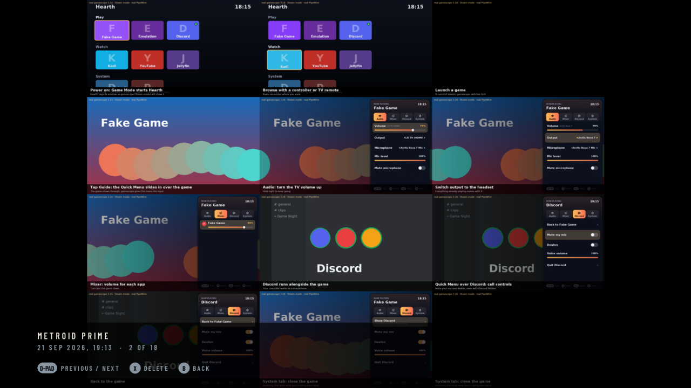

# Hearth OS 0.21.0: progress report

_29 September 2026 · made by `tools/progress_report.py`_

Hearth OS turns a living-room PC into a TV-style home screen for Steam, emulation, streaming apps and Quick Resume, driven by a controller, a TV remote or a Wii Remote. It's built on Bazzite and installs as a system image that updates itself and can always be rolled back. It runs on AMD and Intel graphics; NVIDIA is left for later.

Tested on: Ryzen 7 5800X3D, Radeon RX 6750 XT, 24 GB, 256 GB SATA SSD, Xbox controller, Wii Remotes on a DolphinBar.

## At a glance

| | 0.21.0 | Change since 0.20.0 |
|---|--:|--:|
| Lines of code | 13,506 | +973 |
| Automated tests | 334 | +22 |
| Lines of docs | 1,382 | +122 |
| Guides in docs/ | 11 | +1 |
| Pull requests merged | 22 | |
| Versions released | 21 | |

Lines of code by part (blank lines not counted):

| Part | Lines |
|---|--:|
| Home screen, Quick Menu and settings (Python) | 11,053 |
| System image (scripts, services, config) | 1,071 |
| Build and tools | 1,382 |
| Tests | 4,661 |

## What's new in 0.21.0

- **Captures**: take a screenshot of whatever's playing from the Quick Menu (System → Take a screenshot) or with `hearthctl screenshot`. A Captures tile shows them all: view one full screen, flip through, delete ones you don't want. They're kept in your Pictures folder, named after the game.
- **Your screenshots in the screen saver**, mixed in with your games' art.
- **What's new**: after an update, the home screen shows once what the new version brought (like this).
- **Network by the clock**: Wi-Fi signal bars, a plug when wired, or "offline" when there's no connection.
- **A simpler install guide** and a **hardware compatibility** list: AMD and Intel graphics are supported; NVIDIA is left for later.
- **A progress report for every version**, with lines of code, tests and what's working, in `reports/`.

## What's working

| Area | What it does | Status |
|---|---|---|
| Home screen | TV-style rows, liveries, a backdrop from the focused game, controller batteries and network by the clock | ✅ Confirmed on the PC |
| Emulation | ES-DE with a tile per console; emulators tuned for the GPU and TV | ✅ Confirmed on the PC (Dolphin working) |
| Wii Remote | DolphinBar pointer on the home screen and as a mouse; handed to Dolphin for Wii games | ✅ Confirmed on the PC (pointer working) |
| Quick Resume | Hold Guide to pause a game and pick it up later (up to 3) | 🟡 Shipped |
| Quick Menu | Guide button panel: audio, per-app volume, Discord, stats, power, updates, screenshots | 🟡 Shipped |
| Streaming | YouTube (VacuumTube), Twitch (VacuumStream), Kodi, Jellyfin, Plex, Moonlight | 🟡 Shipped |
| Game stores | Epic Games (Heroic) and Battle.net (Lutris) tiles; their games in the Library | 🟡 Shipped |
| Customising | Favorites with X, move tiles, hide tiles, liveries, sounds | 🟡 Shipped |
| Search and details | Search every app and game; Y on a game for play time and last played | 🟡 Shipped |
| Settings | Wi-Fi, static IP and DNS, Bluetooth, audio devices, storage (format and use a new drive) | 🟡 Shipped |
| Captures **new** | Screenshots from the Quick Menu, a gallery tile, in the screen saver | 🟡 Shipped |
| Updates | Automatic, versioned, with releases on GitHub, a what's-new card and rollback | 🟡 Shipped |
| Phone as a remote | A web page with a d-pad and keyboard, paired with a code on the TV | ⚪ Not started |
| Profiles, folders | Per-person favorites; groups of tiles | ⚪ Not started (deferred for now) |
| NVIDIA graphics | A separate image with NVIDIA's driver | ⚪ Not started (deferred: AMD and Intel first) |
| Netflix and similar | DRM limits these to low quality on any home-built PC | ⛔ Not possible |

**Confirmed** means reported working on the real PC; **Shipped** means built, tested and released, but not yet reported on.

## Screenshots

_What's new: shown once after an update._

_By the clock: Wi-Fi bars, wired, or offline._

_The Captures tile: every screenshot, newest first._

_One screenshot full screen, with delete._

## Open issues

| Issue | Where it stands | What's needed |
|---|---|---|
| Steam "Switch to Desktop" can still hang | Holding Guide for 4 s always gets you home; the cause isn't known | hearthctl status and hearthctl logs right after it happens |
| Recent updates not yet tried on the PC | Built and tested in a virtual display | Update, then try the checklist in the release notes |

## Next

- Your phone as a remote, with a keyboard for search and Wi-Fi passwords.
- Fix what turns up on the real PC.
- When wanted: profiles and groups of tiles; NVIDIA support.

## Every version

| Version | Date | Lines of code | Tests | Docs (lines) | Guides | Pull requests |
|---|---|--:|--:|--:|--:|--:|
| [0.21.0](../0.21.0/report.md) | 2026-09-29 | 13,506 | 334 | 1,382 | 11 | 22 |
| 0.20.0 | 2026-09-29 | 12,533 | 312 | 1,260 | 10 | 20 |
| 0.19.0 | 2026-09-29 | 11,984 | 291 | 1,120 | 9 | 19 |
| 0.18.0 | 2026-09-29 | 11,370 | 270 | 1,067 | 8 | 18 |
| [0.17.0](../0.17.0/report.pdf) | 2026-09-29 | 11,288 | 268 | 1,034 | 8 | 17 |
| 0.16.0 | 2026-09-29 | 10,159 | 233 | 1,022 | 8 | 16 |
| 0.15.0 | 2026-09-29 | 9,817 | 223 | 971 | 7 | 15 |
| 0.14.0 | 2026-09-29 | 9,741 | 218 | 969 | 7 | 14 |
| 0.13.0 | 2026-09-29 | 9,507 | 205 | 954 | 7 | 13 |
| 0.12.0 | 2026-09-27 | 9,474 | 201 | 954 | 7 | 12 |
| 0.11.0 | 2026-09-27 | 9,339 | 195 | 953 | 7 | 11 |
| 0.10.0 | 2026-09-27 | 9,326 | 194 | 940 | 7 | 10 |
| 0.9.0 | 2026-09-27 | 9,111 | 179 | 906 | 7 | 9 |
| 0.8.0 | 2026-09-27 | 9,072 | 173 | 904 | 7 | 8 |
| 0.7.0 | 2026-09-27 | 8,970 | 165 | 901 | 7 | 7 |
| 0.6.0 | 2026-09-27 | 8,931 | 163 | 901 | 7 | 6 |
| 0.5.0 | 2026-09-27 | 8,836 | 157 | 897 | 7 | 5 |
| 0.4.0 | 2026-09-27 | 8,598 | 144 | 888 | 7 | 4 |
| 0.3.0 | 2026-09-27 | 8,597 | 141 | 886 | 7 | 3 |
| 0.2.0 | 2026-09-27 | 8,336 | 132 | 865 | 7 | 2 |
| 0.1.0 | 2026-09-25 | 4,155 | 66 | 703 | 7 | 1 |
