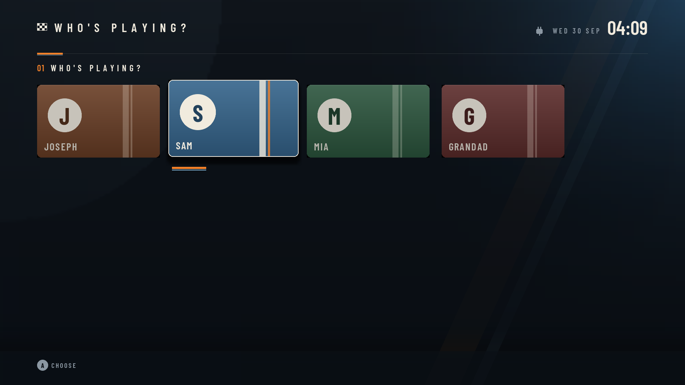
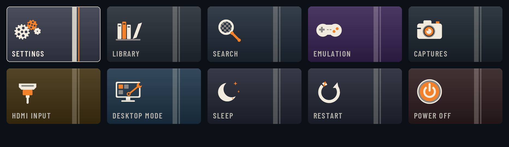

# Hearth OS 0.23.0: progress report

_30 September 2026 · made by `tools/progress_report.py`_

Hearth OS turns a living-room PC into a TV-style home screen for Steam, emulation, streaming apps and Quick Resume, driven by a controller, a TV remote or a Wii Remote. It's built on Bazzite and installs as a system image that updates itself and can always be rolled back. It runs on AMD and Intel graphics; NVIDIA is left for later.

Tested on: Ryzen 7 5800X3D, Radeon RX 6750 XT, 24 GB, 256 GB SATA SSD, Xbox controller, Wii Remotes on a DolphinBar.

## At a glance

| | 0.23.0 | Change since 0.22.4 |
|---|--:|--:|
| Lines of code | 16,930 | +1,445 |
| Automated tests | 433 | +52 |
| Lines of docs | 1,892 | +119 |
| Guides in docs/ | 15 | +1 |
| Pull requests merged | 43 | |
| Versions released | 26 | |

Lines of code by part (blank lines not counted):

| Part | Lines |
|---|--:|
| Home screen, Quick Menu and settings (Python) | 14,341 |
| System image (scripts, services, config) | 1,206 |
| Build and tools | 1,383 |
| Tests | 5,990 |

## What's new in 0.23.0

- **Pictures on the tiles**: Settings is a gearbox, Sleep a moon, Restart a lap of a circuit, Power Off an engine start button, and so on. Apps from Flathub show their own icon.
- **Fixes from the first field tests on the PC**: - Steam: when a game started from its tile ends, Steam closes and you're back home, instead of stuck in Steam's menus. Holding a controller's Home button works on pads that send it as a Menu key (GuliKit). - PC ports (AppImages in ~/Games, like Dusklight) now show up instead of staying on "Starting…", and close cleanly instead of crashing. - The Quick Menu no longer freezes or crashes when audio stops answering (after a trip to Desktop Mode). - Restart and Power Off warn while an update is still downloading. - Wi-Fi shows its real signal on newer kernels. - Home (Quick Menu or `hearthctl home`) closes Settings, and `hearthctl status` says when Settings is open. - Lighter when idle: a Wii Remote lying still and the screen saver use a fraction of the processor they did. - More logs kept (up to 1 GB), so a crash can be looked into afterwards; updates write their progress to their own log. - `hearthctl check`, `press` and `screenshot` are more accurate.
- **People**: add everyone in the household (Settings → People). Hearth then starts on "Who's playing?", with an optional 4-digit PIN each. Each person has their own favorites, Continue row, play times, Steam account and Discord; ROMs, apps and installed games are shared. An admin sets each person's game time, bedtime and locked tiles, and only an admin opens Settings and Desktop Mode. With one person, nothing changes.
- **Erasing a drive asks for your password** (Settings → Storage), the one Desktop Mode and `sudo` use. Using a drive as it is doesn't.
- **Game art finds itself**: emulated games without a picture get one from libretro's free thumbnail library, in the background. `hearthctl art` fetches them now; off in Settings → Home screen.
- **GitHub's `gh` command and `tmux` are built in**, so Claude Code on the PC can file field reports, and keeps working if the SSH connection drops (`tmux new -A -s claude`).

## What's working

| Area | What it does | Status |
|---|---|---|
| Home screen | TV-style rows, liveries, a drawing or icon on every tile, a backdrop from the focused game, controller batteries and network by the clock | ✅ Confirmed on the PC |
| Emulation | ES-DE with a tile per console; emulators tuned for the GPU and TV; game art found automatically | ✅ Confirmed on the PC (Dolphin working) |
| Wii Remote | DolphinBar pointer on the home screen and as a mouse; handed to Dolphin for Wii games | ✅ Confirmed on the PC (pointer working) |
| Quick Resume | Hold Guide to pause a game and pick it up later (up to 3) | 🟡 Shipped |
| Quick Menu | Guide button panel: audio, per-app volume, Discord, stats, power, updates, screenshots | 🟡 Shipped |
| Streaming | YouTube (VacuumTube), Twitch (VacuumStream), Kodi, Jellyfin, Plex, Moonlight | 🟡 Shipped |
| Game stores | Epic Games (Heroic), Battle.net, EA app and Ubisoft Connect (Lutris) tiles; their games in the Library | 🟡 Shipped |
| Customising | Favorites with X, move tiles, hide tiles, liveries, sounds | 🟡 Shipped |
| Search and details | Search every app and game; Y on a game for play time and last played | 🟡 Shipped |
| Settings | Wi-Fi, static IP and DNS, Bluetooth, audio devices, storage (format and use a new drive) | 🟡 Shipped |
| Captures | Screenshots from the Quick Menu, a gallery tile, in the screen saver | 🟡 Shipped |
| Watch next | Shows and films in progress from Jellyfin, Plex and Kodi; resumes and reports back | 🟡 Shipped |
| Family | Daily game-time limit, bedtime and locked tiles behind a PIN, per person | 🟡 Shipped |
| Privacy | No ads or tracking; a guide to turn off the TV's own tracking, by make | 🟡 Shipped |
| TV control (CEC) | TV on and to the right input on wake and on Guide; standby with the PC | 🟡 Shipped |
| Performance | Hearth idles under 2% of one core and about 300 MB; hearthctl footprint | 🟡 Shipped |
| Updates | Automatic, versioned, with releases on GitHub, a what's-new card and rollback | 🟡 Shipped |
| Phone as a remote | A web page with a d-pad and keyboard, paired with a code on the TV | ⚪ Not started |
| People **new** | Who's playing? with optional PINs; own favorites, Continue, Steam and Discord; limits set by an admin | 🟡 Shipped |
| Folders | Groups of tiles | ⚪ Not started (deferred for now) |
| NVIDIA graphics | A separate image with NVIDIA's driver | ⚪ Not started (deferred: AMD and Intel first) |
| Netflix and similar | DRM limits these to low quality on any home-built PC | ⛔ Not possible |

**Confirmed** means reported working on the real PC; **Shipped** means built, tested and released, but not yet reported on.

## Screenshots

_Who's playing?: one tile per person, each with an optional PIN._

_The System tiles, each with its own drawing._

## Open issues

| Issue | Where it stands | What's needed |
|---|---|---|
| A Steam game started cold from its tile stayed on Steam's spinner (Sekiro) | Seen once in the field tests (#40); the cause isn't known yet | The same game from Steam's own Game Mode, and PROTON_LOG=1 |
| Steam "Switch to Desktop" can still hang | Holding Guide for 4 s always gets you home; the cause isn't known | hearthctl status and hearthctl logs right after it happens |
| 0.23.0 not yet tried on the PC | Built and tested in a virtual display; the 0.22.4 field tests found 21 problems, fixed here | Update, then the field tests again (docs/FIELD_TESTS.md) |

## Next

- Your phone as a remote, with a keyboard for search and Wi-Fi passwords.
- Fix what turns up on the real PC.
- When wanted: groups of tiles; NVIDIA support.

## Every version

| Version | Date | Lines of code | Tests | Docs (lines) | Guides | Pull requests |
|---|---|--:|--:|--:|--:|--:|
| [0.23.0](../0.23.0/report.md) | 2026-09-30 | 16,930 | 433 | 1,892 | 15 | 43 |
| [0.22.4](../0.22.4/report.md) | 2026-09-30 | 15,485 | 381 | 1,773 | 14 | 26 |
| [0.22.2](../0.22.2/report.md) | 2026-09-30 | 15,066 | 374 | 1,556 | 13 | 26 |
| [0.22.1](../0.22.1/report.md) | 2026-09-30 | 15,008 | 370 | 1,548 | 13 | 25 |
| [0.22.0](../0.22.0/report.md) | 2026-09-29 | 15,005 | 369 | 1,544 | 13 | 24 |
| [0.21.0](../0.21.0/report.md) | 2026-09-29 | 13,506 | 334 | 1,371 | 11 | 23 |
| 0.20.0 | 2026-09-29 | 12,533 | 312 | 1,260 | 10 | 20 |
| 0.19.0 | 2026-09-29 | 11,984 | 291 | 1,120 | 9 | 19 |
| 0.18.0 | 2026-09-29 | 11,370 | 270 | 1,067 | 8 | 18 |
| [0.17.0](../0.17.0/report.pdf) | 2026-09-29 | 11,288 | 268 | 1,034 | 8 | 17 |
| 0.16.0 | 2026-09-29 | 10,159 | 233 | 1,022 | 8 | 16 |
| 0.15.0 | 2026-09-29 | 9,817 | 223 | 971 | 7 | 15 |
| 0.14.0 | 2026-09-29 | 9,741 | 218 | 969 | 7 | 14 |
| 0.13.0 | 2026-09-29 | 9,507 | 205 | 954 | 7 | 13 |
| 0.12.0 | 2026-09-27 | 9,474 | 201 | 954 | 7 | 12 |
| 0.11.0 | 2026-09-27 | 9,339 | 195 | 953 | 7 | 11 |
| 0.10.0 | 2026-09-27 | 9,326 | 194 | 940 | 7 | 10 |
| 0.9.0 | 2026-09-27 | 9,111 | 179 | 906 | 7 | 9 |
| 0.8.0 | 2026-09-27 | 9,072 | 173 | 904 | 7 | 8 |
| 0.7.0 | 2026-09-27 | 8,970 | 165 | 901 | 7 | 7 |
| 0.6.0 | 2026-09-27 | 8,931 | 163 | 901 | 7 | 6 |
| 0.5.0 | 2026-09-27 | 8,836 | 157 | 897 | 7 | 5 |
| 0.4.0 | 2026-09-27 | 8,598 | 144 | 888 | 7 | 4 |
| 0.3.0 | 2026-09-27 | 8,597 | 141 | 886 | 7 | 3 |
| 0.2.0 | 2026-09-27 | 8,336 | 132 | 865 | 7 | 2 |
| 0.1.0 | 2026-09-25 | 4,155 | 66 | 703 | 7 | 1 |
